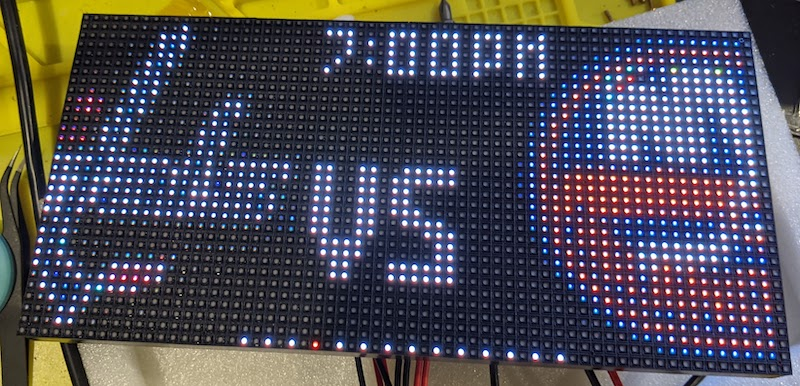
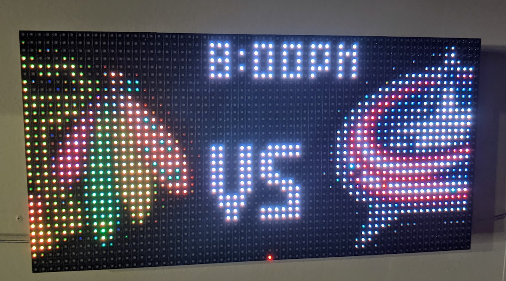
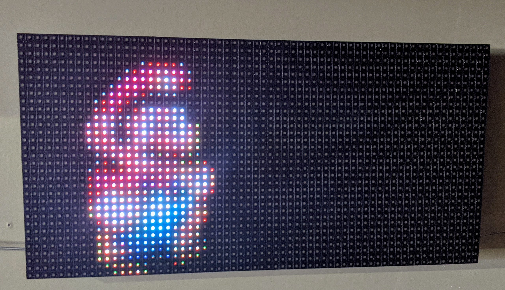

# Raspberry Pi Sports LED Matrix
Go-based software to control a raspberry pi LED matrix.



This is a Go project for displaying various types of "Boards" on a Raspberry Pi controlled RGB Matrix. The ideas here were heavily inspired by https://github.com/riffnshred/nhl-led-scoreboard . It uses some CGO bindings for the RGB matrix library https://github.com/hzeller/rpi-rgb-led-matrix. I chose to create my own project based off of those existing ideas because I wanted to be able to easily extend support for additional sports (see [Roadmap](#roadmap) section). I chose to write this in Go because I prefer it over Python, and theoretically it will run more efficiently than a Python-based one.

I am currently running this with a Pi-zero. It performs perfectly well so far. I've tried to implement caching whenever possible at various layers to make this thing as efficient as possible. It aims to reduce IO by storing images and such in memory.

*WARNING* This project is still very early in development. There will be lots of churn and breakage for a while.

## Current Board Types

- NHL: Displays the day's games. Either live scores (favorite teams' scores are hideable for those who watch games recorded), Upcoming games, or final scores.
- Image Board: Takes a list of directories containg images and displays them. Works with GIF's too!
- Clock: It's...a clock
- MLB: Currently still in progress

## Roadmap

#### More Sports
My goal is to add new boards for all the major sports that I'm personally interested in. For now, that list includes (order of priority) MLB, College Football, NFL, and possibly something for PGA Tour (maybe in time for the Masters?).

#### Web API for on-the-fly config changes
~I ultimately would like to integrate a web API that allows certain things to be modified on the fly- this would ideally mean a simple web UI for tweaking things without having to access the Pi and restart the service.~
The Web API is a thing now! Check out [HTTP Endpoints](#http-endpoints)

#### More Misc. Boards
I'd like to add some other basic boards- ~clock~, weather, etc.

## Installation
My goal is to soon provide an easy installer script...

The manual steps:
- Clone this repository onto your Pi
- Run `script/build.local`. This will result in a binary named "sportsmatrix.bin" inside the cloned repo directory.

## Configuration
You can run the app without passing any configuration, it will just use some sane defaults. Currently it only defaults to showing the NHL board. Each board that is enabled will be rotated through.

Example:
```shell
---
# Image Board. It rotates between all the images in the given directories
imageConfig:
  enabled: true # Enable the board
  useDiskCache: true # Will cache resized images to disk (somewhere in /tmp)
  boardDelay: 5s # Delay time between each image
  directories:
  - /tmp/images
  
# NHL Board
nhlConfig:
  enabled: true # Enable the board
  hideFavoriteScore: true # Hides the score of a live game that your favorite teams are playing in
  boardDelay: "20s" # Delay time between each game board
  favoriteSticky: true # If this is true, the board will stick to games that your favorite team is playing in. Prioritizes based on ordering
  favoriteTeams: # The list of your favorite teams
  - NYI
  watchTeams: # The list of teams to show games for. Leaving this out or setting to ALL will show all teams in the league
  - ALL
  
# Primary configuration for the matrix  
sportsMatrixConfig:
  httpListenPort: 8080 # Listen port for the HTTP server. Defaults to 8080
  screenOffTimes: # Cron values for when the screen should be turned off
  - "38 0 * * *"
  screenOnTimes: # Cron values for when the screen should be turned on
  - "39 0 * * *"
  hardwareConfig: # Hardware config based straight through to the https://github.com/hzeller/rpi-rgb-led-matrix library
    brightness: 60
    hardwareMapping: adafruit-hat-pwm
    showRefreshRate: false
 ```

## Running the Board
The app currently only runs in the foreground, there's no builtin daemonizing mechanism. Maybe one day I'll provide systemd (or whatever Raspbian uses) configs. For now, I suggest either running the app in a screen session or manually backgrounding the process. 

NOTE: You *MUST* run the app via sudo. The underlying C library requires it. It does switch to a less-privileged user after the matrix is initialized.
```shell
# Run with defaults
sudo ./sportsmatrix.bin run

# With config file
sudo ./sportsmatrix.bin run -c myconfig.conf

# NHL demo mode
sudo ./sportsmatrix.bin nhltest
```

## HTTP endpoints
The sportsmatrix creates some HTTP endpoints for on-the-fly changes. The matrix itself registers some endpoints, and each board is capable of registering it's own.

The matrix defines the following:
- `/screenon` => Turns the board on
- `/screenoff` => Turns the board off
Examples:
```shell
curl http://127.0.0.1:8080/screenon
curl http://127.0.0.1:8080/screenoff
```

The sportboard.SportBoard type (which all the team sport types use) implements the following:
- `/[sport_path]/disable` => Disable the board. The matrix will skip this board in the rotation
- `/[sport_path]/enable` => Enable the board.
- `/[sport_path]/hidefavoritescore` => Hide scores for games that favorite teams are playing in. 
- `/[sport_path]/showfavoritescore` => Show scores for games that favorite teams are in.
- `/[sport_path]/favoritesticky` => Pins the matrix to a live game that a favorite team is participating in.
- `/[sport_path]/favoriteunstick` => Unsticks a favorite team game

Examples:
```shell
curl http://127.0.0.1:8080/nhl/showfavoritescore
curl http://127.0.0.1:8080/mlb/favoritesticky
```

The imageboard can be turned on/off and also have it's cache cleared
```shell
curl http://127.0.0.1:8080/img/enable
curl http://127.0.0.1:8080/img/disable
curl http://127.0.0.1:8080/img/clearcache
```

## Contributing / Development
I'm always open to pull requests for features/bug fixes! Feel free to open an issue if (when) you find a bug.

I have tried implementing cross-compile support with docker, because building on a Pi Zero is quite slow. It sort of works, but with some weird caveats: running the cross-compiled binary on the Pi is resulting in brighter/washed out images for me. If anyone can figure out how to make this work better, please let me know.

```shell
# Building directly on a Pi. Creates a binary named "sportsmatrix.bin"
script/build.local

# To build an armv6l image (for a Pi zero) in docker:
# This results in a binary named "sportsmatrix.armv6l"
script/build.armv6l

# To build arm7 image (Pi 4?). Results in a binary
# named "sportsmatrix.arm7"
script/build.arm7
```

#### Implementing a new Board
Any new boards just need to implement the [board.Board](pkg/board/board.go) interface. A new sports type board would be best to implement the API, Team, and Game interfaces in a [sportboard.SportBoard](pkg/sportboard/sportboard.go) (See the [NHL Board](pkg/nhl/nhl.go) for an example).

## Examples


In real life, this is a GIF of Mario running. This is using the Image Board.

