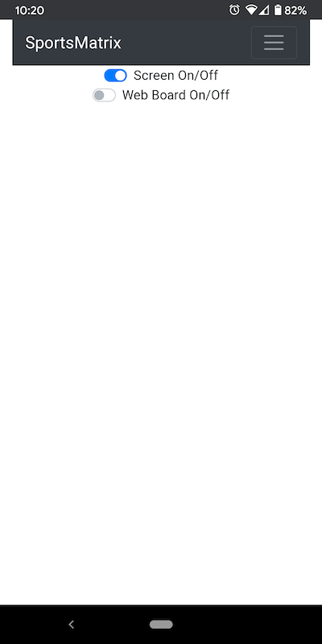

# Raspberry Pi Sports LED Matrix
Go-based software to control a raspberry pi LED matrix.


This is a Go project for displaying various types of "Boards" on a Raspberry Pi controlled RGB Matrix. The ideas here were heavily inspired by https://github.com/riffnshred/nhl-led-scoreboard . It uses some CGO bindings for the RGB matrix library https://github.com/hzeller/rpi-rgb-led-matrix. I chose to create my own project based off of those existing ideas because I wanted to be able to easily extend support for additional sports (see [Roadmap](#roadmap) section). I chose to write this in Go because I prefer it over Python, and theoretically it will run more efficiently than a Python-based one.

I run this on a Pi zero and a Pi 4. If you want to use the "Web Board" feature (see [Web UI](#web-ui)), I recommend at least a Pi 3.

#### Table of Contents
- [Getting Help](#getting-help)<br>
- [Donations/Beer Money](#donations-and-beer-money)<br>
- [Board Types](#current-board-types)<br>
- [Roadmap](#roadmap)<br>
- [Installation](#installation)<br>
- [Configuration](#configuration)<br>
- [Running the Board](#running-the-board)<br>
- [Web UI Controller](#web-ui)<br>
- [API Endpoint](#api-endpoints)<br>
- [Contributing/Development](#contributing)<br>
- [Examples](#examples)<br>

## Getting Help
There's a public Discord channel, "RGB Sportsmatrix Help" https://discord.gg/8vPp4xfdtV

## Donations and Beer Money
If you feel so inclined, beer money can be sent to my Venmo (www.venmo.com/u/Robby-Dyer). Never required, always appreciated.

## Current Board Types

- Sports. Shows upcoming, live, and completed games for the day (or the week for football), as well as news headlines:
  - NHL
  - MLB
  - NFL
  - NBA
  - MLS
  - NCAA Football
  - NCAA Men's Basketball
  - English Premiere League
  - PGA Tour Leaderboards
- Racing. Currently just shows upcoming event schedule
  - F1
- Stock Ticker
- Weather
- Player Stats boards- currently supports MLB and NHL.
- Image Board: Takes a list of directories containg images and displays them. Works with GIF's too!
- Clock
- Sys: Displays basic system info. Currently Mem and CPU usage

## Installation

### Supported Pi
This project currently supports all Raspberry Pi's with an armv7l or aarch64 architecture. This includes Pi 3b, 4, Zero 2. Pi's with the armv6 architecture are no longer supported,
but those can run version v0.0.83 and older- this would include the original Pi Zero.

You can check your Pi's architecture by running the following command:
```shell
uname -m
```

### Install script
There's a helper install script that pulls the latest release's .deb package and installs it and starts the service. Obviously, piping a
remote script to `sudo bash` is risky, so please take a look at `script/install.sh` to verify nothing nefarious is going on. You can always manually download the .deb package in the [Releases Section](https://github.com/robbydyer/sports/releases/latest). Just make sure to pick the correct one for your architecture.

Run the following command in a Terminal on your Pi
```shell
curl https://raw.githubusercontent.com/robbydyer/sports/master/script/install.sh | sudo bash
```

To try out the latest beta release, run the following on your Pi:
```shell
curl https://raw.githubusercontent.com/robbydyer/sports/master/script/beta-install.sh | sudo bash
```

### Installing from source
If you wish to install from source (either you don't trust the released .deb or you have a non-supported Pi), you can
compile the binary on your own Pi. There are two options:

#### Just Compile the binary
You can just compile the binary, skipping the systemctl configuration. Clone the repo to your Pi, then run the build script. This will result in a file named `sportsmatrix.bin`

```shell
script/build.local
```

#### Build your own DEB package
You can build your own copy of the DEB package- these are what are distributed with official releases and are what
`script/install.sh` and `script/beta-install.sh` install. You must set a `VERSION` env var, but it can be anything you want.

```shell
VERSION=1.0.0 script/deb-build.sh
```

## Configuration
You can run the app without passing any configuration, it will just use some sane defaults. Currently it only defaults to showing the NHL board. Each board that is enabled will be rotated through. The default location for the config file is `/etc/sportsmatrix.conf`

See the [Full Example Configuration](sportsmatrix.conf.example)<br>

For a list of all possible team abbreviations (including conference/divisions when available), see [this list](all_team_abbreviations.txt)<br>

## Running the Board
If you installed the app with the installer script or a .deb package directly, then the service will run automatically. You can start/stop/restart the service with systemctl commands:
```shell
# stops the service
sudo systemctl stop sportsmatrix

# Restarts the service, like after changes to the config file
sudo systemctl restart sportsmatrix
```

You can also run the app manually in the foreground. The .deb package installs the binary to `/usr/local/bin/sportsmatrix`
NOTE: You *MUST* run the app via sudo. The underlying C library requires it. It does switch to a less-privileged user after the matrix is initialized.
```shell
# Show all CLI options
sportsmatrix --help

# Run with defaults
sudo sportsmatrix.bin run

# With config file
sudo sportsmatrix.bin run -c myconfig.conf

# NHL demo mode
sudo sportsmatrix.bin nhltest
```

## Web UI
There is a (very) basic web UI frontend for managing the board. It is bundled with the binary and served as a single-page app. The UI gives buttons for all the backend [API Endpoints](#api-endpoints). You can also view a rendered version of the board in the "Board" section (make sure your configuration enables this). Front-end dev is not my strongsuit, so it's not particularly pretty.

The Web UI is accessible at `http://[HOSTNAME OR IP]:[PORT]`, where port is whatever you configure the `httpListenPort` in your config file to be. For example, if your Pi's hostname is `mypi` and your configured listen port is `8080`, `http://mypi:8080`

   

Example of the Web Board:<br>


## API endpoints
The Web UI has a built-in doc page describing the API. It also includes an interactive way to test API calls. There's a
button in the nav "API Docs", or you can go to `http://[YOURIP]/docs`

### Special "Jump only" Image directories
If you would like to configure certain image directories to contain "jump only" images (only seen when an API call is made to show them), you can
do so by configuring them like:

```
imageConfig:
  directoryList:
  - directory: /my/image/dir
    jumpOnly: true
```

Then, to display a particular image in that directory, make the API call and pass the desired image name.

```
curl -X POST --header "Content-Type: application/json" -d '{"name":"goal.gif"}' "http://myhost:myport/imageboard.v1.ImageBoard/Jump"
```

## Contributing
I'm always open to pull requests for features/bug fixes! Feel free to open an issue if (when) you find a bug.

For easy/faster testing without compiling on a Pi, you can use the `ConsoleMatrix` type for generating the board layout in the terminal.

```shell
$ script/shell.console
...
# Set the --test or -t flag to use the ConsoleMatrix
root@1be09d37bbd9:/src# go run ./cmd/sportsmatrix/ run -t -c matrix.conf
...
_ _ _ _ _ _ _ _ _ _ _ _ _ _ _ _ _ _ _ _ _ _ _ _ _ _ _ _ _ _ _ _ _ _ _ _ _ _ _ _ _ _ _ _ _ _ _ _ _ _ _ _ _ _ _ _ _ _ _ _ _ _ _ _ _
|
|                                                                                                  R       G G G G R G G G G     |
|                                                W W W       W W W   W W W   W W W   W   W             G R R R R R R R R R R R   |
|                                                    W   W   W   W   W   W   W   W   W W W   0     G R R R                   R   |
|B B B       B B B B B B B B       B B B B B B B     W       W   W   W   W   W   W   W   W 0   G R R R     W R B R R R B R W     |
|B B B B B B B B B B B B B B B B B B B B B B B B   W     W   W   W   W   W   W W W   W   W   R R R     R W W W B R R R B W W W   |
|B B B B B B B B B B B B B B B B B B B B B B B   W           W W W   W W W   W       W R W R R R   W R W W W W B R R R B W W W   |
|B B B B B B B B B B B B B B B B B B B B B B B   B                                       W R R B R R G W W W W B R R R B W W W   |
|B B B B B B B B B B B B B B B B B B B B B B   W                                     R   G R   R R R W B B B B B R R R B B B W   |
|B B B B B B B B B B B B B B B B B B B B B B   B                                   0   G R   R W R R R R R R R R R R R R R R B   |
|B B B B B B B B B B B B B B B B B B B B B B   W                                   R   R R   R G B R R R R R R R R R R R R R R   |
|B B B B B B B B B B B B B B B B B B B B B B   B                                 R   R R   R B W B B R R       B R R R R     R   |
|B B B B B B B B B B B B B B B B B B B B B B   B                                 R   R R   W   W R W B R R   R R R R R R R 0     |
|B B B B B B B B B B B B B B B B B B B B B B   B                                     R R   W W W W R B R R   R R B R R W R R 0   |
|B B B B B B B B B R R R R R R R R R R R B B   B                                   R R   R   W W W W W R R B R R B W W B R R R   |
|B B B B B B B B B B B R R R R R R R R R B B   B                               0   G R   B B B B B B B R R   R R R R R R R R     |
|B B B B B B B B B B B B R R R R R R R R B B   B W W     W W     W W W W W     R   G R   R R R R R R R R R   R R R R R R R   R   |
|B B B B B B B B B B B B B R R R R R R R B B   B W W     W W   W W W W W W     0   G R   R R R R R R R R R                 0 R   |
|B B B B B B B B B B B B B B B R R R R R B B   B W W     W W   W W             R   G R   R R R R R R R R R   R R R R R R R   R   |
|B W B B B B B B B B B B B B B B R R R R B B   B W W     W W   W W             0   G R   B B B B B B B R R   R R R R R R R R     |
|B B B W B B B B B B B B B B B B B B R R B B   B W W     W W   W W W               R R   R   W W W W W R R B R R B W W B R R R   |
|B W B B W B B B B B B B B B B B B B B R B B   B W W     W W     W W W W             R R   W W W W R B R R   R R B R R W R R 0   |
|B W B W B W W B B B B B B B B B B B B B B B   B W W     W W         W W W       R   R R   W   W R W B R R   R R R R R R R 0     |
|B W B W W B W W B B B B B B B B B B B B B B   B   W W W W             W W       R   R R   R B W B B R R       B R R R R     R   |
|B   B W W W W B W B B B B B B B B B B B B B   B   W W W W             W W         R   R R   R G B R R R R R R R R R R R R R R   |
|B B B B B B B B B W W B B B B B B B B B B B         W W       W W W W W W         0   G R   R W R R R R R R R R R R R R R R B   |
|B               W B B W B B B B B B B B B B   W     W W       W W W W W W           R   R R   R R R W B B B B B R R R B B B W   |
|B B B B B B B B B     B B B B B B B B B B B   B                                         W R R B R R G W W W W B R R R B W W W   |
|B B B B B B B B B B B B B B B B B B B B B B W                                         R   R R R   W R W W W W B R R R B W W W   |
|B B B B B B B B B B B B B B B B B B B B B B                                             0   R R R     R W W W B R R R B W W W   |
|                  B B                   W                                                 0   G R R R     W R B R R R B R W     |
|    B B B B B B B     B B B B B B B                                                         0     G R R R                   R   |
|                                                              R   W                                                             |
_ _ _ _ _ _ _ _ _ _ _ _ _ _ _ _ _ _ _ _ _ _ _ _ _ _ _ _ _ _ _ _ _ _ _ _ _ _ _ _ _ _ _ _ _ _ _ _ _ _ _ _ _ _ _ _ _ _ _ _ _ _ _ _ _ |
...
_ _ _ _ _ _ _ _ _ _ _ _ _ _ _ _ _ _ _ _ _ _ _ _ _ _ _ _ _ _ _ _ _ _ _ _ _ _ _ _ _ _ _ _ _ _ _ _ _ _ _ _ _ _ _ _ _ _ _ _ _ _ _ _ _
|
|                                                                                                                                |
|                                                                                                                                |
|                                                                                                                                |
|                                                                                                                                |
|                                                                                                                                |
|                                                                                                                                |
|                                                                                                                                |
|                                                                                                                                |
|                                                                                                                                |
|                                                                                                                                |
|                                                                                                                                |
|                                                                                                                                |
|                                                                                                                                |
|                                                                                                                                |
|              W W W W                 W W W W W W W W     W W W W W W W W         W W W W         W W             W W           |
|              W W W W                 W W W W W W W W     W W W W W W W W         W W W W         W W             W W           |
|          W W         W W     W W     W W                             W W     W W         W W     W W W W     W W W W           |
|          W W         W W     W W     W W                             W W     W W         W W     W W W W     W W W W           |
|              W W W W                 W W W W W W                 W W         W W         W W     W W     W W     W W           |
|              W W W W                 W W W W W W                 W W         W W         W W     W W     W W     W W           |
|          W W         W W     W W                 W W         W W             W W W W W W W W     W W             W W           |
|          W W         W W     W W                 W W         W W             W W W W W W W W     W W             W W           |
|              W W W W                 W W W W W W             W W             W W         W W     W W             W W           |
|              W W W W                 W W W W W W             W W             W W         W W     W W             W W           |
|                                                                                                                                |
|                                                                                                                                |
|                                                                                                                                |
|                                                                                                                                |
|                                                                                                                                |
|                                                                                                                                |
|                                                                                                                                |
|                                                                                                                                |
_ _ _ _ _ _ _ _ _ _ _ _ _ _ _ _ _ _ _ _ _ _ _ _ _ _ _ _ _ _ _ _ _ _ _ _ _ _ _ _ _ _ _ _ _ _ _ _ _ _ _ _ _ _ _ _ _ _ _ _ _ _ _ _ _ |
```

I have tried implementing cross-compile support with docker, because building on a Pi Zero is quite slow. It sort of works, but with some weird caveats: running the cross-compiled binary on the Pi is resulting in brighter/washed out images for me. If anyone can figure out how to make this work better, please let me know.

```shell
# Building directly on a Pi. Creates a binary named "sportsmatrix.bin"
script/build.local

# To build an armv6l image (for a Pi zero) in docker:
# This results in a binary named "sportsmatrix.armv6l"
script/build.armv6l

# To build arm7 image (Pi 4?). Results in a binary
# named "sportsmatrix.arm7"
script/build.arm7
```

#### Implementing a new Board
Any new boards just need to implement the [board.Board](pkg/board/board.go) interface. A new sports type board would be best to implement the API, Team, and Game interfaces in a [sportboard.SportBoard](pkg/sportboard/sportboard.go) (See the [NHL Board](pkg/nhl/nhl.go) for an example).

## Examples
NHL


MLB


STOCK TICKER


PGA Tour Leaderboard


NHL Stats


MLB Stats


TV Mode, MLB Board


TV Mode, NHL Stats


In real life, this is a GIF of Mario running. This is using the Image Board.

