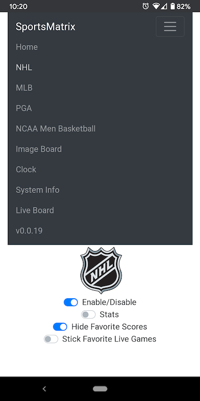
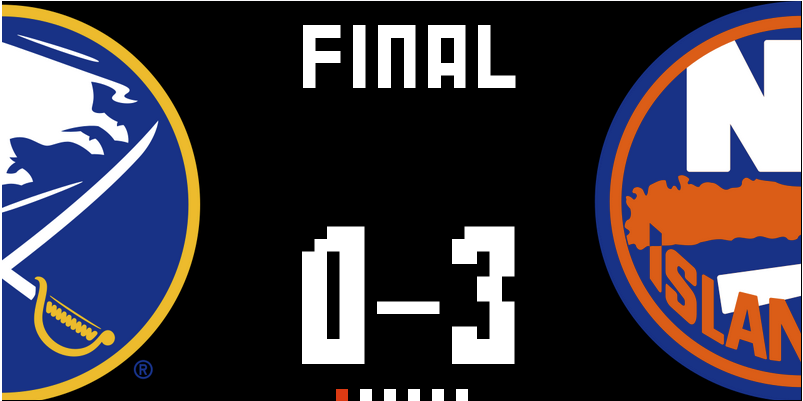
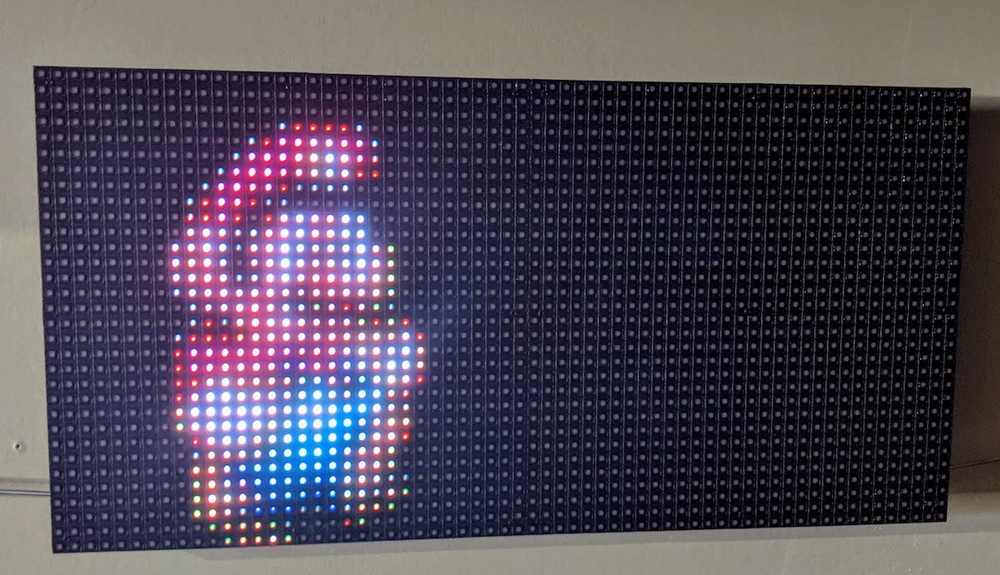

# Raspberry Pi Sports LED Matrix
Go-based software to control a raspberry pi LED matrix.


This is a Go project for displaying various types of "Boards" on a Raspberry Pi controlled RGB Matrix. The ideas here were heavily inspired by https://github.com/riffnshred/nhl-led-scoreboard . It uses some CGO bindings for the RGB matrix library https://github.com/hzeller/rpi-rgb-led-matrix. I chose to create my own project based off of those existing ideas because I wanted to be able to easily extend support for additional sports (see [Roadmap](#roadmap) section). I chose to write this in Go because I prefer it over Python, and theoretically it will run more efficiently than a Python-based one.

I run this on a Pi zero and a Pi 4. If you want to use the "Web Board" feature (see [Web UI](#web-ui)), I recommend at least a Pi 3.

#### Table of Contents
- [Board Types](#current-board-types)<br>
- [Roadmap](#roadmap)<br>
- [Installation](#installation)<br>
- [Configuration](#configuration)<br>
- [Running the Board](#running-the-board)<br>
- [Web UI Controller](#web-ui)<br>
- [API Endpoint](#api-endpoints)<br>
- [Contributing/Development](#contributing)<br>
- [Examples](#examples)<br>

## Current Board Types

- NHL, MLB, NCAA Men's Basketball : Shows upcoming, live, and completed games for the day
- Image Board: Takes a list of directories containg images and displays them. Works with GIF's too!
- Clock: It's...a clock
- Sys: Displays basic system info. Currently Mem and CPU usage

## Roadmap

#### More Sports
My goal is to add new boards for all the major sports that I'm personally interested in. For now, that list includes College Football, NFL, and possibly something for PGA Tour (maybe in time for the Masters?).

#### Web API for on-the-fly config changes
~I ultimately would like to integrate a web API that allows certain things to be modified on the fly- this would ideally mean a simple web UI for tweaking things without having to access the Pi and restart the service.~
The Web API is a thing now! Check out [API Endpoints](#api-endpoints)

#### More Misc. Boards
I'd like to add some other basic boards- ~clock~, weather, etc.

## Installation
There's a helper install script that pulls the latest release's .deb package and installs it and starts the service. Obviously, piping a
remote script to `sudo bash` is risky, so please take a look at `script/install.sh` to verify nothing nefarious is going on. You can always manually download the .deb package in the [Releases Section](https://github.com/robbydyer/sports/releases/latest). Just make sure to pick the correct one for your architecture (armv7l for all but Pi Zero).

Run the following command in a Terminal on your Pi
```shell
curl https://raw.githubusercontent.com/robbydyer/sports/master/script/install.sh | sudo bash
```

## Configuration
You can run the app without passing any configuration, it will just use some sane defaults. Currently it only defaults to showing the NHL board. Each board that is enabled will be rotated through. The default location for the config file is `/etc/sportsmatrix.conf`

See the [Full Example Configuration](sportsmatrix.conf.example)<br>

## Running the Board
If you installed the app with the installer script or a .deb package directly, then the service will run automatically. You can start/stop/restart the service with systemctl commands:
```shell
# stops the service
sudo systemctl stop sportsmatrix

# Restarts the service, like after changes to the config file
sudo systemctl restart sportsmatrix
```

You can also run the app manually in the foreground. The .deb package installs the binary to `/usr/local/bin/sportsmatrix`
NOTE: You *MUST* run the app via sudo. The underlying C library requires it. It does switch to a less-privileged user after the matrix is initialized.
```shell
# Show all CLI options
sportsmatrix --help

# Run with defaults
sudo sportsmatrix.bin run

# With config file
sudo sportsmatrix.bin run -c myconfig.conf

# NHL demo mode
sudo sportsmatrix.bin nhltest
```

## Web UI
There is a (very) basic web UI frontend for managing the board. It is bundled with the binary and served as a single-page app. The UI gives buttons for all the backend [API Endpoints](#api-endpoints). You can also view a rendered version of the board in the "Board" section (make sure your configuration enables this). Front-end dev is not my strongsuit, so it's not particularly pretty.

The Web UI is accessible at `http://[HOSTNAME OR IP]:[PORT]`, where port is whatever you configure the `httpListenPort` in your config file to be. For example, if your Pi's hostname is `mypi` and your configured listen port is `8080`, `http://mypi:8080`

   

Example of the Web Board:<br>


## API endpoints
The sportsmatrix creates some HTTP endpoints for on-the-fly changes. The matrix itself registers some endpoints, and each board is capable of registering it's own.

The matrix defines the following:
- `/api/screenon` => Turns the board on
- `/api/screenoff` => Turns the board off
Examples:
```shell
curl http://127.0.0.1:8080/api/screenon
curl http://127.0.0.1:8080/api/screenoff
```

The sportboard.SportBoard type (which all the team sport types use) implements the following:
- `/api/[sport_path]/disable` => Disable the board. The matrix will skip this board in the rotation
- `/api/[sport_path]/enable` => Enable the board.
- `/api/[sport_path]/hidefavoritescore` => Hide scores for games that favorite teams are playing in. 
- `/api/[sport_path]/showfavoritescore` => Show scores for games that favorite teams are in.
- `/api/[sport_path]/favoritesticky` => Pins the matrix to a live game that a favorite team is participating in.
- `/api/[sport_path]/favoriteunstick` => Unsticks a favorite team game

Examples:
```shell
curl http://127.0.0.1:8080/api/nhl/showfavoritescore
curl http://127.0.0.1:8080/api/mlb/favoritesticky
```

The imageboard can be turned on/off and also have it's cache cleared
```shell
curl http://127.0.0.1:8080/api/img/enable
curl http://127.0.0.1:8080/api/img/disable
curl http://127.0.0.1:8080/api/img/clearcache
```

## Contributing
I'm always open to pull requests for features/bug fixes! Feel free to open an issue if (when) you find a bug.

For easy/faster testing without compiling on a Pi, you can use the `ConsoleMatrix` type for generating the board layout in the terminal.

```shell
$ script/shell.console
...
# Set the --test or -t flag to use the ConsoleMatrix
root@1be09d37bbd9:/src# go run -mod=vendor ./cmd/sportsmatrix/ run -t -c matrix.conf
...
_ _ _ _ _ _ _ _ _ _ _ _ _ _ _ _ _ _ _ _ _ _ _ _ _ _ _ _ _ _ _ _ _ _ _ _ _ _ _ _ _ _ _ _ _ _ _ _ _ _ _ _ _ _ _ _ _ _ _ _ _ _ _ _ _
|
|                                                                                                  R       G G G G R G G G G     |
|                                                W W W       W W W   W W W   W W W   W   W             G R R R R R R R R R R R   |
|                                                    W   W   W   W   W   W   W   W   W W W   0     G R R R                   R   |
|B B B       B B B B B B B B       B B B B B B B     W       W   W   W   W   W   W   W   W 0   G R R R     W R B R R R B R W     |
|B B B B B B B B B B B B B B B B B B B B B B B B   W     W   W   W   W   W   W W W   W   W   R R R     R W W W B R R R B W W W   |
|B B B B B B B B B B B B B B B B B B B B B B B   W           W W W   W W W   W       W R W R R R   W R W W W W B R R R B W W W   |
|B B B B B B B B B B B B B B B B B B B B B B B   B                                       W R R B R R G W W W W B R R R B W W W   |
|B B B B B B B B B B B B B B B B B B B B B B   W                                     R   G R   R R R W B B B B B R R R B B B W   |
|B B B B B B B B B B B B B B B B B B B B B B   B                                   0   G R   R W R R R R R R R R R R R R R R B   |
|B B B B B B B B B B B B B B B B B B B B B B   W                                   R   R R   R G B R R R R R R R R R R R R R R   |
|B B B B B B B B B B B B B B B B B B B B B B   B                                 R   R R   R B W B B R R       B R R R R     R   |
|B B B B B B B B B B B B B B B B B B B B B B   B                                 R   R R   W   W R W B R R   R R R R R R R 0     |
|B B B B B B B B B B B B B B B B B B B B B B   B                                     R R   W W W W R B R R   R R B R R W R R 0   |
|B B B B B B B B B R R R R R R R R R R R B B   B                                   R R   R   W W W W W R R B R R B W W B R R R   |
|B B B B B B B B B B B R R R R R R R R R B B   B                               0   G R   B B B B B B B R R   R R R R R R R R     |
|B B B B B B B B B B B B R R R R R R R R B B   B W W     W W     W W W W W     R   G R   R R R R R R R R R   R R R R R R R   R   |
|B B B B B B B B B B B B B R R R R R R R B B   B W W     W W   W W W W W W     0   G R   R R R R R R R R R                 0 R   |
|B B B B B B B B B B B B B B B R R R R R B B   B W W     W W   W W             R   G R   R R R R R R R R R   R R R R R R R   R   |
|B W B B B B B B B B B B B B B B R R R R B B   B W W     W W   W W             0   G R   B B B B B B B R R   R R R R R R R R     |
|B B B W B B B B B B B B B B B B B B R R B B   B W W     W W   W W W               R R   R   W W W W W R R B R R B W W B R R R   |
|B W B B W B B B B B B B B B B B B B B R B B   B W W     W W     W W W W             R R   W W W W R B R R   R R B R R W R R 0   |
|B W B W B W W B B B B B B B B B B B B B B B   B W W     W W         W W W       R   R R   W   W R W B R R   R R R R R R R 0     |
|B W B W W B W W B B B B B B B B B B B B B B   B   W W W W             W W       R   R R   R B W B B R R       B R R R R     R   |
|B   B W W W W B W B B B B B B B B B B B B B   B   W W W W             W W         R   R R   R G B R R R R R R R R R R R R R R   |
|B B B B B B B B B W W B B B B B B B B B B B         W W       W W W W W W         0   G R   R W R R R R R R R R R R R R R R B   |
|B               W B B W B B B B B B B B B B   W     W W       W W W W W W           R   R R   R R R W B B B B B R R R B B B W   |
|B B B B B B B B B     B B B B B B B B B B B   B                                         W R R B R R G W W W W B R R R B W W W   |
|B B B B B B B B B B B B B B B B B B B B B B W                                         R   R R R   W R W W W W B R R R B W W W   |
|B B B B B B B B B B B B B B B B B B B B B B                                             0   R R R     R W W W B R R R B W W W   |
|                  B B                   W                                                 0   G R R R     W R B R R R B R W     |
|    B B B B B B B     B B B B B B B                                                         0     G R R R                   R   |
|                                                              R   W                                                             |
_ _ _ _ _ _ _ _ _ _ _ _ _ _ _ _ _ _ _ _ _ _ _ _ _ _ _ _ _ _ _ _ _ _ _ _ _ _ _ _ _ _ _ _ _ _ _ _ _ _ _ _ _ _ _ _ _ _ _ _ _ _ _ _ _ |
...
_ _ _ _ _ _ _ _ _ _ _ _ _ _ _ _ _ _ _ _ _ _ _ _ _ _ _ _ _ _ _ _ _ _ _ _ _ _ _ _ _ _ _ _ _ _ _ _ _ _ _ _ _ _ _ _ _ _ _ _ _ _ _ _ _
|
|                                                                                                                                |
|                                                                                                                                |
|                                                                                                                                |
|                                                                                                                                |
|                                                                                                                                |
|                                                                                                                                |
|                                                                                                                                |
|                                                                                                                                |
|                                                                                                                                |
|                                                                                                                                |
|                                                                                                                                |
|                                                                                                                                |
|                                                                                                                                |
|                                                                                                                                |
|              W W W W                 W W W W W W W W     W W W W W W W W         W W W W         W W             W W           |
|              W W W W                 W W W W W W W W     W W W W W W W W         W W W W         W W             W W           |
|          W W         W W     W W     W W                             W W     W W         W W     W W W W     W W W W           |
|          W W         W W     W W     W W                             W W     W W         W W     W W W W     W W W W           |
|              W W W W                 W W W W W W                 W W         W W         W W     W W     W W     W W           |
|              W W W W                 W W W W W W                 W W         W W         W W     W W     W W     W W           |
|          W W         W W     W W                 W W         W W             W W W W W W W W     W W             W W           |
|          W W         W W     W W                 W W         W W             W W W W W W W W     W W             W W           |
|              W W W W                 W W W W W W             W W             W W         W W     W W             W W           |
|              W W W W                 W W W W W W             W W             W W         W W     W W             W W           |
|                                                                                                                                |
|                                                                                                                                |
|                                                                                                                                |
|                                                                                                                                |
|                                                                                                                                |
|                                                                                                                                |
|                                                                                                                                |
|                                                                                                                                |
_ _ _ _ _ _ _ _ _ _ _ _ _ _ _ _ _ _ _ _ _ _ _ _ _ _ _ _ _ _ _ _ _ _ _ _ _ _ _ _ _ _ _ _ _ _ _ _ _ _ _ _ _ _ _ _ _ _ _ _ _ _ _ _ _ |
```

I have tried implementing cross-compile support with docker, because building on a Pi Zero is quite slow. It sort of works, but with some weird caveats: running the cross-compiled binary on the Pi is resulting in brighter/washed out images for me. If anyone can figure out how to make this work better, please let me know.

```shell
# Building directly on a Pi. Creates a binary named "sportsmatrix.bin"
script/build.local

# To build an armv6l image (for a Pi zero) in docker:
# This results in a binary named "sportsmatrix.armv6l"
script/build.armv6l

# To build arm7 image (Pi 4?). Results in a binary
# named "sportsmatrix.arm7"
script/build.arm7
```

#### Implementing a new Board
Any new boards just need to implement the [board.Board](pkg/board/board.go) interface. A new sports type board would be best to implement the API, Team, and Game interfaces in a [sportboard.SportBoard](pkg/sportboard/sportboard.go) (See the [NHL Board](pkg/nhl/nhl.go) for an example).

## Examples


In real life, this is a GIF of Mario running. This is using the Image Board.

